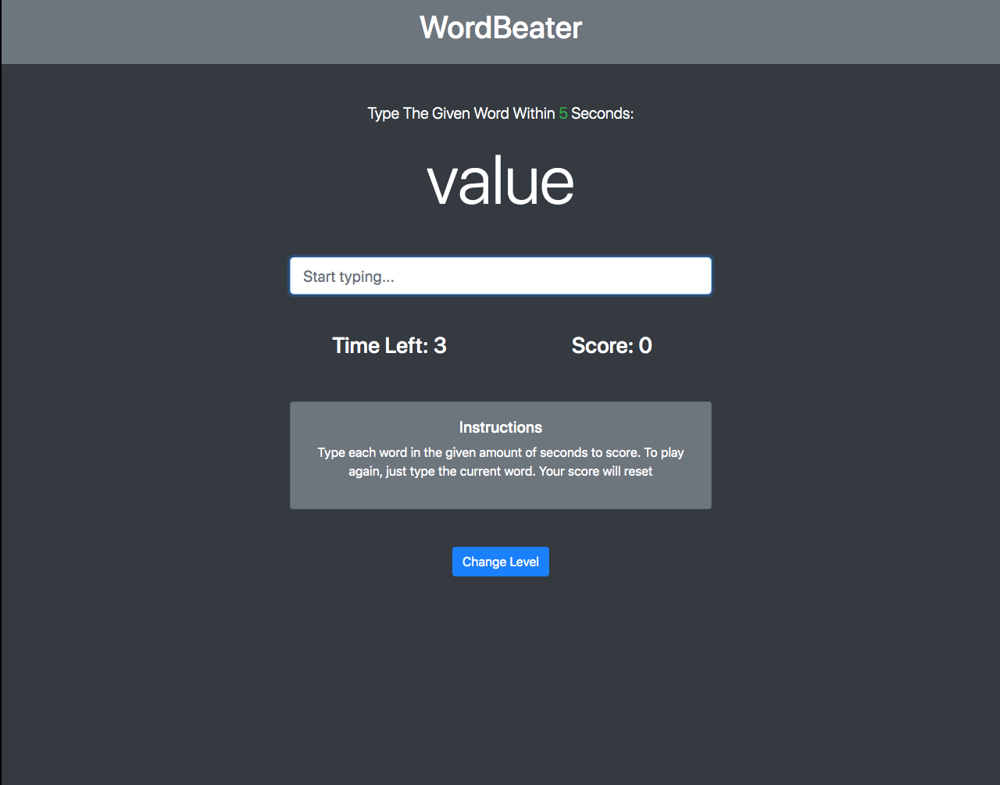

# Speed Typing Game

> A simple and fun typing game where you race against the clock and improve your typing speed, using the 30 most common Javascript words.

## Demo

Here's a working live demo of the project: https://julianehiem.github.io/JS-Speed-Typing-Game/

## Tech/framework used

- [HTML](https://developer.mozilla.org/en-US/docs/Web/HTML)
- [CSS](https://developer.mozilla.org/en-US/docs/Web/CSS)
- [JS](https://developer.mozilla.org/en-US/docs/Web/JavaScript)

## Links

- Repository: https://github.com/JulianEhiem/JS-Speed-Typing-Game

## License

This project is licensed under the terms of the **MIT** license.

MIT © [JulianEhiem](https://github.com/JulianEhiem)
